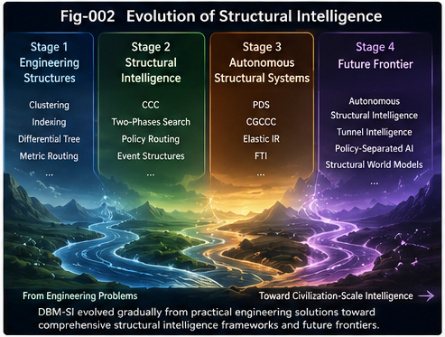
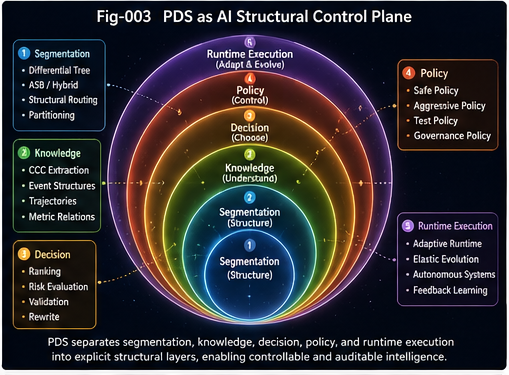
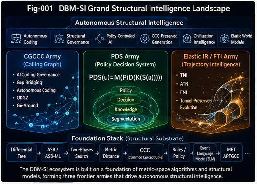
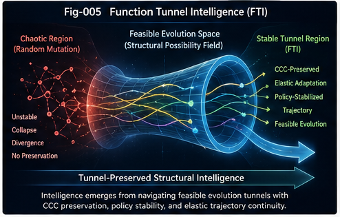
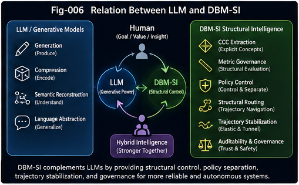
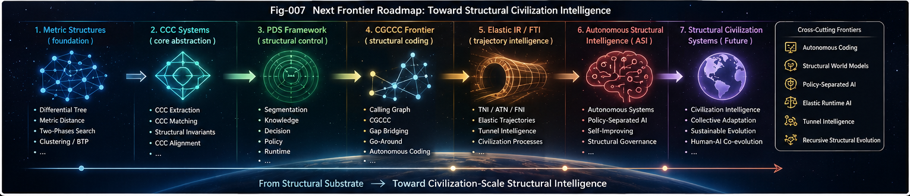
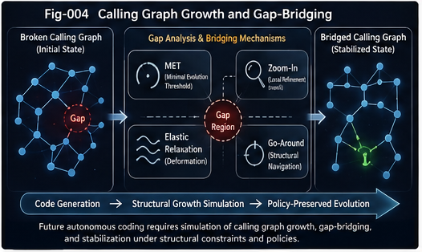

# Metric-Structural-Intelligence-Grand-Map
## A Reader’s Gateway to Structural AI, Function Tunnels, Policy Control, and Calling Graph Intelligence

## Abstract

This document presents a high-level review, integration, and outlook of the evolving DBM-SI (Digital Brain Model – Structural Intelligence) research program, including its related directions such as ASI (Autonomous Structural Intelligence), FTI (Function Tunnel Intelligence), PDS (Policy Decision System), CGCCC (Calling Graph Common Concept Core), Elastic Trajectory Intelligence, and associated structural-runtime frameworks.

Rather than treating intelligence as purely statistical prediction or parameter scaling, DBM-SI investigates intelligence as a structural process involving:

- metric-space organization,
- CCC (Common Concept Core) extraction,
- trajectory stabilization,
- tunnel-preserved evolution,
- policy-controlled derivation,
- structural governance,
- elastic relaxation,
- and autonomous gap-bridging.

Over multiple independent repositories and DOI releases, DBM-SI has gradually accumulated a coherent technology stack spanning:

- differential trees,
- metric routing,
- CCC extraction,
- policy decision systems,
- calling-graph governance,
- elastic trajectory intelligence,
- event language models,
- and autonomous structural runtime systems.

This document serves as:

1. a review of the accumulated foundational technologies,
2. a map of the major frontier research directions,
3. a positioning analysis relative to LLMs and World Models,
4. and a forward-looking proposal for future structural intelligence systems.

The central thesis emerging from this body of work is:

> Intelligence is not merely prediction.\
> Intelligence is structural navigation inside feasible evolution tunnels under policy and stability constraints.

## 1. Introduction

The DBM-SI research direction did not emerge from a single isolated theory or one-shot architecture design.

Instead, it emerged gradually through years of engineering observations, algorithmic experimentation, runtime modeling, AI-coding governance exploration, and increasingly deep collaboration between human reasoning and large language models.

One important conclusion repeatedly observed throughout this process is:

> Many difficult AI problems become more understandable once reformulated as structural navigation problems in metric spaces.

This shift changes the nature of the problem itself.

Instead of asking:

- “Can a model predict the next token?”
- “Can a neural network fit this distribution?”
- “Can scaling alone solve the problem?”

DBM-SI asks:

- What structural invariants must be preserved?
- What CCCs define the feasible region?
- What trajectories remain stable under perturbation?
- What policy controls govern safe evolution?
- How can gap-bridging occur without structural collapse?
- How can autonomous systems grow while preserving core identity?

These questions gradually led to the formation of several major branches:

- Differential Tree and metric routing systems,
- CCC extraction and structural matching,
- Policy Decision Systems (PDS),
- Calling Graph governance for AI coding,
- Elastic trajectory intelligence,
- Function Tunnel Intelligence (FTI),
- and Autonomous Structural Intelligence (ASI).

Together, these components increasingly form a unified structural intelligence landscape.

## 2. Foundation Technology Stack

The DBM-SI stack is built upon accumulated foundational algorithms and runtime structures.

These technologies were not designed independently.\
They gradually converged into a mutually reinforcing ecosystem.

### 2.1 Differential Tree / ASB / ASB-ML / Clustering

Differential Trees and ASB-style adaptive segmentation systems provide the foundation for variable-granularity structural partitioning.

These systems support:

- adaptive routing,
- hierarchical search,
- structural dispatch,
- elastic partitioning,
- and scalable local modeling.

Later evolutions introduced:

- Metric Differential Trees,
- Hybrid Trees,
- ASB-ML dispatch policies,
- and topology-aware structural segmentation.

These systems became essential for scalable structural intelligence runtimes.

### 2.2 Two-Phases Search

DBM-SI repeatedly found that many intelligent processes naturally decompose into:

1. candidate retrieval,
2. structural re-ranking.

This led to the Two-Phases Search paradigm:

- Phase 1: fast retrieval,
- Phase 2: metric-distance evaluation and structural scoring.

This pattern appears repeatedly across:

- CCC matching,
- calling graph governance,
- policy routing,
- trajectory intelligence,
- AI coding validation,
- and elastic runtime systems.

### 2.3 Metric Distance

Metric distance evolved into one of the most central concepts in DBM-SI.

Unlike simple similarity scores, metric distance is treated as:

- structural feasibility,
- preservation compatibility,
- policy stability,
- and trajectory continuity.

Directional and asymmetric metrics became particularly important in:

- calling graph analysis,
- CGCCC governance,
- structural rewriting,
- and tunnel-preserved evolution.

### 2.4 Bucket Tree of Permutation (BTP)

BTP-style structures support permutation-aware organization and scalable metric-space decomposition.

These systems help manage:

- combinational explosion,
- candidate ordering,
- structural routing,
- and elastic search-space navigation.

### 2.5 Common Concept Core (CCC)

CCC gradually emerged as one of the most important abstractions in DBM-SI.

CCC represents:

- structural invariants,
- reusable conceptual cores,
- stable trajectory anchors,
- and tunnel-preserving constraints.

Several forms emerged:

- Static CCC,
- Behavioral CCC,
- Triggering CCC,
- Recursive CCC,
- and Cross-System CCC alignment.

CCC later became foundational for:

policy-preserved generation,
AI coding governance,
trajectory intelligence,
and tunnel-preserved evolution.

### 2.6 Rules Engines and Policy Systems

Traditional rules engines are reinterpreted in DBM-SI as:

> structural policy stabilization systems.

This later evolved into the PDS framework:

    PDS(u)=M(P(D(K(S(u)))))

where:

- S: segmentation,
- K: knowledge extraction,
- D: decision,
- P: policy,
- M: runtime execution and adaptation.

This formulation gradually became one of the core control-plane abstractions in DBM-SI.

### 2.7 Event Language Model (ELM)

ELM investigates intelligence through:

- event sequences,
- trajectory evolution,
- trigger propagation,
- and temporal structural patterns.

ELM acts as a bridge between:

- time-series intelligence,
- trajectory intelligence,
- policy systems,
- and civilization-scale structural evolution.

### 2.8 APCTGOE and MET

APCTGOE and MET provide evolutionary guidance principles.

MET (Minimal Evolution Threshold) became particularly important.

Rather than assuming arbitrary mutation or unrestricted generation, MET emphasizes:

- feasible evolution,
- minimum structural movement,
- elastic relaxation,
- policy-preserved adaptation,
- and tunnel-stable progression.

This principle later became deeply connected to:

- FTI,
- CG gap-bridging,
- autonomous coding,
- and structural runtime evolution.

## 3. Three Front Armies

Over time, DBM-SI development converged around three major frontier directions.

These “front armies” represent the most active and strategically important research fronts.

### 3A. Calling Graph / CGCCC Frontier

This frontier investigates:

- AI coding governance,
- structural compliance,
- autonomous code growth,
- gap-bridging,
- and policy-preserved rewriting.

Key concepts include:

- SOS structures,
- CGCCC,
- Delta-CCC,
- Vertical Gap Bridging,
- Horizontal Gap Bridging,
- ODGZ,
- and Go-Around structural navigation.

One major emerging conclusion is:

> Future autonomous coding systems must model calling-graph growth itself.

This represents a transition from:

- code generation,\
toward:
- structural growth simulation.

### 3B. Policy Decision System (PDS) Frontier

PDS investigates intelligence as a policy-controlled structural runtime.

Rather than embedding all intelligence directly into model parameters, PDS separates:

- knowledge,
- decision,
- policy,
- and execution.

This creates:

- auditable reasoning,
- policy-controlled adaptation,
- structural governance,
- and runtime controllability.

Recent extensions include:

- CCC-Preserved Generation (CPG),
- Core-CCC-Preserved Analysis (CPA),
- trajectory-preserved derivation,
- and structural decision surfaces.

### 3C. Elastic Trajectory / FTI Frontier

Trajectory intelligence evolved from time-series routing into a broader framework involving:

- elastic structural evolution,
- tunnel-preserved navigation,
- feasible derivation,
- and civilization-scale trajectory analysis.

This eventually led to:

- TNI,
- ATN,
- and Function Tunnel Intelligence (FTI).

FTI proposes that many stable intelligent systems evolve not through arbitrary mutation, but through:

- tunnel-constrained structural evolution,
- CCC-preserved derivation,
- and policy-stabilized feasible trajectories.

This direction extends naturally from software systems toward:

- biology,
- language,
- civilization,
- collective learning,
- and autonomous societies.

## 4. Relation to LLMs and World Models

DBM-SI does not position itself against LLMs.

In fact, DBM-SI itself emerged partly through human–LLM collaborative exploration.

This is itself an important observation.

### 4.1 LLM Scaling Works — But with Diminishing Structural Return

DBM-SI recognizes that LLM scale provides enormous gains.

However, repeated observations suggest:

- scaling alone increasingly faces structural inefficiencies,
- hidden policies become entangled with parameters,
- and trajectory stability becomes difficult to control.

### 4.2 DBM-SI as a Structural Control Plane

DBM-SI proposes that future AI systems may require a structural control plane layered above generative models.

LLMs remain extremely valuable for:

- generation,
- language compression,
- explanation,
- abstraction,
- and semantic reconstruction.

But DBM-SI adds:

- CCC extraction,
- policy separation,
- metric governance,
- trajectory stabilization,
- structural auditing,
- and tunnel-preserved derivation.

### 4.3 CCC Emission and Policy Separation

One major future direction is helping LLMs explicitly emit CCCs rather than hiding them implicitly inside parameters.

Another is separating:

- policy,\
from:
- trained statistical representation.

This separation may become essential for:

- trustworthy AI,
- autonomous coding,
- runtime governance,
- and long-term adaptive systems.

### 4.4 Relation to World Models

DBM-SI suggests that many future World Model improvements may require:

- elastic trajectory intelligence,
- tunnel-preserved reasoning,
- CCC stabilization,
- and policy-aware structural evolution.

In this sense, FTI and Elastic IR may help explain and enhance the deeper mechanisms underlying future World Models.

## 5. Next Frontiers

Several major frontier directions now emerge.

### 5.1 CCC-Aware Generative Systems

Future AI systems may increasingly generate:

- explicit CCCs,
- structural traces,
- policy surfaces,
- and trajectory-preserved derivations.

### 5.2 Policy-Parameter Separation

Separating policy from parameters may become one of the defining architectural transitions of future AI systems.

This could fundamentally improve:

- controllability,
- auditability,
- safety,
- and adaptive governance.

### 5.3 Calling Graph Growth Simulation

One of the most important future frontiers is:

> autonomous simulation of calling graph growth and bridging.

This is likely essential for:

- AI autonomous coding,
- runtime adaptation,
- recursive software evolution,
- and large-scale structural synthesis.

Human and biological systems already appear to perform such processes naturally through:

- elastic relaxation,
- local exploration,
- go-around behavior,
- zooming-in,
- MET-constrained adaptation,
- and task-action co-evolution.

DBM-SI has already accumulated multiple mechanisms relevant to this direction.

This may become one of the defining bridges between:

- software engineering,
- autonomous systems,
- structural intelligence,
- and future AGI architectures.

## 6. Conclusion

DBM-SI, ASI, FTI, PDS, CGCCC, Elastic IR, and related structural intelligence frameworks increasingly form a coherent technological landscape.

Together, they suggest an alternative trajectory for future AI systems:

- not purely scaling,
- not purely prediction,
- not purely symbolic reasoning,
- but structurally governed intelligent evolution.

The long-term direction increasingly points toward:

- CCC-centered intelligence,
- tunnel-preserved evolution,
- policy-controlled autonomy,
- and structurally auditable adaptive systems.

The emerging thesis is increasingly clear:

> Intelligence is the ability to preserve structural identity while navigating feasible evolution tunnels under changing environments, goals, and policies.